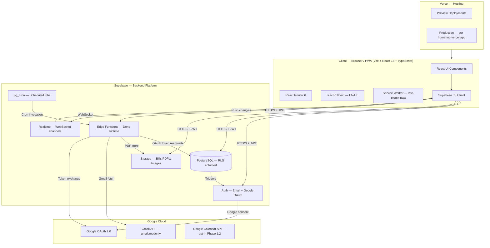
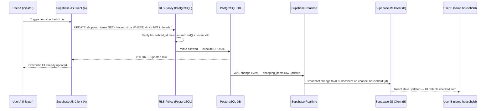
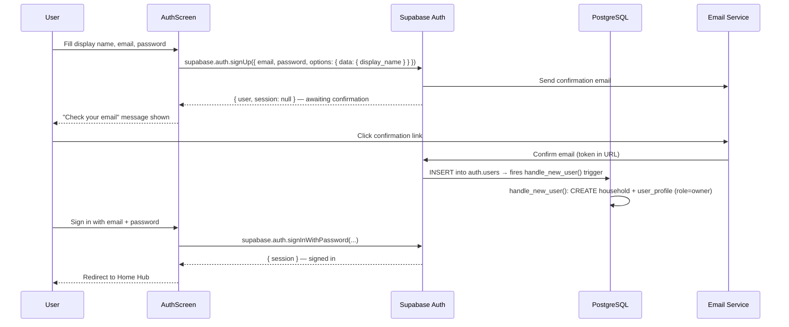
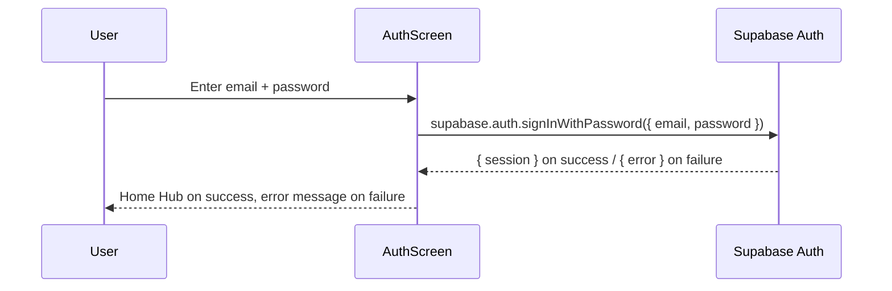
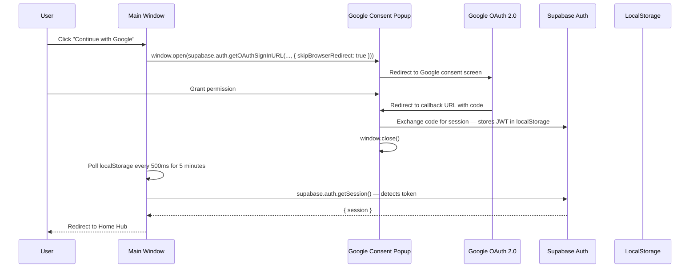
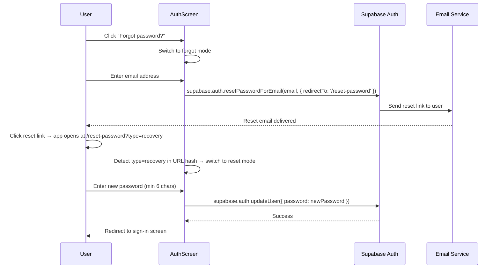
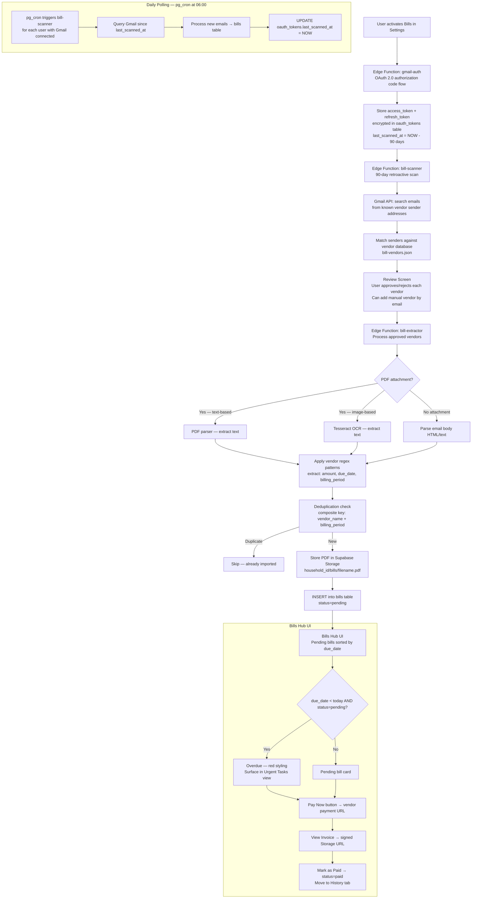
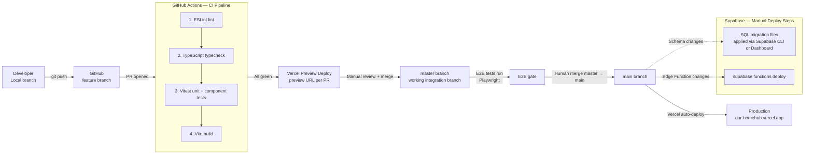

# HomeHub — System Architecture

**Status:** Living document | **Last updated:** 2026-03-26
**Source of truth for:** system structure, data flows, auth flows, bills pipeline, Edge Function contracts, deployment pipeline, service dependencies

---

## 1. Full System Architecture



**Layer responsibilities:**

| Layer | Technology | Responsibility |
|-------|-----------|---------------|
| PWA Shell | Vite 5 + vite-plugin-pwa | App bundle, service worker, offline cache |
| UI Framework | React 18 + TypeScript strict | All components (functional + hooks only) |
| Styling | Tailwind CSS 4 | Utility classes, CSS variable themes (Burgundy/Mint) |
| Routing | React Router 6 | Client-side SPA routes |
| i18n | react-i18next | EN/HE translation, RTL switching |
| State | Supabase JS client | Server state; minimal local state via useState |
| Auth | Supabase Auth | Email/password, Google OAuth popup |
| Database | Supabase PostgreSQL | All persistent data, RLS, triggers, pg_cron |
| Storage | Supabase Storage | Bill PDFs, voucher/reservation images |
| Edge Functions | Supabase Deno | Gmail OAuth flow, bill scanning, push dispatch |
| Realtime | Supabase Realtime | Cross-client sync of household changes |
| Hosting | Vercel | CI/CD preview + production auto-deploy |
| Email scanning | Gmail API | Bill extraction (gmail.readonly scope) |
| Social login | Google OAuth 2.0 | Sign-in with Google |

---

## 2. Data Flow — User Action to All Clients

How a mutation (e.g., user checks off a shopping item) propagates through the system:



**Key points:**
- Every write passes through RLS before touching the DB; `household_id IN (SELECT household_id FROM user_profiles WHERE id = auth.uid())` is the universal guard.
- Child table writes (e.g., `shopping_items`) inherit household access by joining to their parent (`shopping_lists.household_id`).
- Realtime channels are scoped per `household_id` — members only receive changes for their own household.
- The Supabase JS client subscribes to Realtime on mount and unsubscribes on unmount.
- All reads are also RLS-filtered — a user cannot query another household's data even with a valid JWT.

---

## 3. Auth Flows

### 3.1 Sign-Up (Email + Password)



### 3.2 Sign-In (Email + Password)



### 3.3 Google OAuth (Popup Flow)



### 3.4 Join Household via Invite Code

```mermaid
sequenceDiagram
    participant User
    participant AuthScreen
    participant LocalStorage
    participant SBAuth as Supabase Auth
    participant DB as PostgreSQL

    User->>AuthScreen: Enter invite code + display name + email + password
    AuthScreen->>LocalStorage: Store invite code as "homehub-pending-invite"
    AuthScreen->>SBAuth: supabase.auth.signUp(...)
    SBAuth-->>AuthScreen: Awaiting email confirmation
    User->>User: Click email confirmation link
    AuthScreen->>SBAuth: supabase.auth.signInWithPassword(...)
    SBAuth-->>AuthScreen: { session }
    AuthScreen->>LocalStorage: Read "homehub-pending-invite"
    AuthScreen->>DB: CALL join_household_via_invite(invite_code)
    DB->>DB: Validate invite (not expired, not used, exists)
    DB->>DB: UPDATE user_profiles SET household_id = inviter's household
    DB->>DB: Mark invite as used (used_by, used_at)
    DB->>DB: DELETE the new user's auto-created empty household
    DB-->>AuthScreen: Success
    AuthScreen->>LocalStorage: Remove "homehub-pending-invite"
    AuthScreen-->>User: Welcome screen shown; existing member notified via Realtime
```

### 3.5 Password Reset



---

## 4. Bills Pipeline



**Pipeline stages summary:**

| Stage | Component | Input | Output |
|-------|-----------|-------|--------|
| Auth | `gmail-auth` Edge Function | OAuth code from Google | `access_token`, `refresh_token` stored in `oauth_tokens` |
| Initial scan | `bill-scanner` Edge Function | `last_scanned_at` = 90 days ago | List of detected vendors + email IDs |
| User review | Bills Settings UI | Vendor list with sample subjects | Approved vendor set |
| Extraction | `bill-extractor` Edge Function | Approved vendor emails | `bills` rows + PDFs in Storage |
| Daily refresh | pg_cron → `bill-scanner` | `last_scanned_at` | New `bills` rows since last run |
| Token refresh | `gmail-fetch` Edge Function | Expired `access_token` | Fresh token via `refresh_token` |

---

## 5. Edge Function API Contracts

All Edge Functions run in the Supabase Deno runtime. They are invoked via `supabase.functions.invoke(name, { body })` from the client, or by pg_cron (server-side).

> **Response envelope:** All Edge Function responses follow the `{ success, data/error }` envelope defined in BACKEND.md §7. The examples below show the full wrapped format. On success: `{ "success": true, "data": { ... } }`. On error: `{ "success": false, "error": { "code": "...", "message": "..." } }`. The BACKEND.md §1.x entries are the authoritative contracts — refer there for full error response tables.

---

### 5.1 `gmail-auth`

**Purpose:** Complete the OAuth 2.0 authorization code exchange with Google. Stores encrypted tokens in `oauth_tokens`.

**Triggered by:** Client (Settings → Connect Gmail button)

**Input:**
```json
{
  "code": "string",          // Authorization code from Google OAuth callback
  "redirect_uri": "string"   // Must match registered OAuth redirect URI
}
```

**Output (success):**
```json
{
  "success": true,
  "data": {
    "connected": true,
    "email": "string"        // Gmail address that was authorized
  }
}
```

**Output (error):**
```json
{
  "success": false,
  "error": {
    "code": "google_token_exchange_failed",
    "message": "string"
  }
}
```

**Side effects:**
- UPSERT into `oauth_tokens` with `access_token`, `refresh_token`, `expires_at`, `scopes`, `last_scanned_at = NOW() - INTERVAL '90 days'`
- RLS: writes scoped to `auth.uid()` only

---

### 5.2 `gmail-disconnect`

**Purpose:** Revoke Gmail access and remove stored tokens.

**Triggered by:** Client (Settings → Disconnect Gmail)

**Input:** None (user identified from JWT)

**Output (success):**
```json
{
  "success": true,
  "data": {
    "disconnected": true
  }
}
```

**Side effects:**
- DELETE from `oauth_tokens` WHERE `user_id = auth.uid()` AND `provider = 'google'`
- Calls Google token revocation endpoint

---

### 5.3 `bill-scanner`

**Purpose:** Scan Gmail for emails from known vendors, return list of detected vendors for user review. On subsequent invocations (daily cron), process new emails since `last_scanned_at`.

**Triggered by:** Client (initial activation) OR pg_cron (daily at 06:00)

**Input:**
```json
{
  "user_id": "uuid",         // Only when invoked by pg_cron (no JWT context)
  "mode": "initial" | "incremental"
}
```
When invoked from client, `user_id` is derived from JWT.

**Output (initial mode — returns vendors for review):**
```json
{
  "success": true,
  "data": {
    "vendors": [
      {
        "vendor_name": "string",
        "sender_email": "string",
        "sample_subjects": ["string"],
        "email_count": 42
      }
    ]
  }
}
```

**Output (incremental mode — processes and imports):**
```json
{
  "success": true,
  "data": {
    "imported": 3,
    "skipped_duplicates": 1,
    "errors": []
  }
}
```

**Side effects:**
- Calls `gmail-fetch` to get a valid access token before querying Gmail
- Calls Gmail API `users.messages.list` with sender filter
- On incremental: calls `bill-extractor` for each new email
- On incremental: UPDATE `oauth_tokens SET last_scanned_at = NOW()`

---

### 5.4 `bill-extractor`

**Purpose:** Download and parse a bill email/attachment. Extract structured fields. Store PDF in Supabase Storage. Insert into `bills` table.

**Triggered by:** `bill-scanner` (server-to-server, no client JWT)

**Input:**
```json
{
  "user_id": "uuid",
  "household_id": "uuid",
  "gmail_message_id": "string",
  "vendor_name": "string",
  "payment_url": "string"
}
```

**Output (success):**
```json
{
  "success": true,
  "data": {
    "bill_id": "uuid",
    "amount": 320.00,
    "due_date": "2026-04-15",
    "billing_period": "2026-03",
    "pdf_path": "household_id/bills/filename.pdf"
  }
}
```

**Output (skip — duplicate):**
```json
{
  "success": true,
  "data": {
    "skipped": true,
    "reason": "duplicate: vendor_name+billing_period already exists"
  }
}
```

**Side effects:**
- Calls Gmail API `users.messages.get` + `users.messages.attachments.get`
- Runs PDF text extraction (pdfjs) or Tesseract OCR on attachment
- Applies vendor-specific regex from `bill-vendors.json`
- `storage.upload()` to `household_id/bills/` bucket
- INSERT into `bills` table (skips if composite key conflict)

---

### 5.5 `gmail-fetch`

**Purpose:** Return a valid Gmail access token for a user, refreshing it if expired.

**Triggered by:** Other Edge Functions (`bill-scanner`, `bill-extractor`)

**Input:**
```json
{
  "user_id": "uuid"
}
```

**Output (success):**
```json
{
  "success": true,
  "data": {
    "access_token": "string",
    "expires_at": "ISO8601 timestamp"
  }
}
```

**Output (error):**
```json
{
  "success": false,
  "error": {
    "code": "token_missing",
    "message": "string"
  }
}
```

**Side effects:**
- If `access_token` is expired: calls Google token refresh endpoint
- UPSERT `oauth_tokens SET access_token, expires_at` with new token

---

### 5.6 `push-dispatcher` *(Phase 1.3)*

**Purpose:** Deliver Web Push notifications to subscribed devices.

**Triggered by:** pg_cron (daily digest at 08:00) OR Supabase DB webhook on relevant table changes

**Input:**
```json
{
  "household_id": "uuid",
  "event_type": "bill_arrived" | "task_urgent" | "voucher_expiring" | "daily_digest",
  "payload": {
    "title": "string",
    "body": "string",
    "url": "string"
  }
}
```

**Output:**
```json
{
  "sent": 2,
  "failed": 0
}
```

**Side effects:**
- Reads `push_subscriptions` table for household members with notifications enabled
- Calls Web Push API for each subscribed device
- Respects quiet hours setting per user

---

## 6. Deployment Pipeline



**Branch strategy:**

| Branch | Purpose | Deploy target |
|--------|---------|---------------|
| `feature/*` | Human developer work | None (CI checks only) |
| `polecat/<name>` | Agent (polecat) work — automatically named by the Gas Town harness | None (CI checks only) |
| `master` | Integration branch — all PRs merge here | Vercel preview per PR |
| `main` | Production source of truth | Vercel production (auto) |

> **Branch naming note:** Human developer branches use `feature/*`. Agent (polecat) branches are automatically named `polecat/<polecat-name>` by the Gas Town harness. Both branch types target `master` for integration. Do not use `agent/{task-id}` for polecats — the harness controls branch naming.

**CI pipeline steps (in order):**

1. `eslint` — lint check, must pass
2. `tsc --noEmit` — TypeScript typecheck, must pass
3. `vitest run` — unit + component tests, must pass (>80% business logic coverage)
4. `vite build` — production build, must succeed
5. Vercel preview deploy (triggered automatically on PR)
6. Playwright E2E (runs on merge to `master`)

**Supabase deployment (manual steps, outside CI):**
- SQL migrations: applied via Supabase CLI (`supabase db push`) or Supabase Dashboard SQL editor
- Edge Functions: deployed via `supabase functions deploy <function-name>` from the repo root
- Storage buckets and RLS policies: configured in Supabase Dashboard

---

## 7. Service Dependencies

| Service | Purpose | Required Env Vars | Notes |
|---------|---------|-------------------|-------|
| **Supabase** | Auth, Database, Storage, Edge Functions, Realtime | `VITE_SUPABASE_URL`, `VITE_SUPABASE_ANON_KEY` | Client-side vars prefixed `VITE_`. Service role key never in client. |
| **Supabase** (server-side) | Edge Functions access DB with elevated privileges | `SUPABASE_SERVICE_ROLE_KEY` | Edge Function env only. Never exposed to browser. |
| **Vercel** | Hosting + CI/CD | Configured in Vercel dashboard; no app env var needed | Auto-deploy from `main`; preview from PRs |
| **Google OAuth 2.0** | Sign in with Google + Gmail access authorization | `GOOGLE_CLIENT_ID`, `GOOGLE_CLIENT_SECRET` | `GOOGLE_CLIENT_ID` also exposed as `VITE_GOOGLE_CLIENT_ID` for popup flow. Secret is Edge Function only. |
| **Gmail API** | Read user emails for bill extraction | `GOOGLE_CLIENT_ID`, `GOOGLE_CLIENT_SECRET` | Scope: `gmail.readonly`. Tokens stored encrypted in `oauth_tokens` table. |
| **Google Calendar API** | Read personal calendar events (opt-in, Phase 1.2) | `GOOGLE_CLIENT_ID`, `GOOGLE_CLIENT_SECRET` | Same OAuth app, additional scope: `calendar.readonly`. Not in scope for Phase 1.0/1.1. |
| **Web Push (VAPID)** | Push notifications to PWA subscribers (Phase 1.3) | `VAPID_PUBLIC_KEY`, `VAPID_PRIVATE_KEY`, `VAPID_SUBJECT` | `VAPID_PUBLIC_KEY` also in `VITE_VAPID_PUBLIC_KEY` for service worker. |
| **pg_cron** | Schedule daily bill scanning at 06:00 | None — built into Supabase Pro | Invoke Edge Function via `net.http_post`. Requires Supabase Pro tier. |

**All environment variables summary:**

| Variable | Where used | Visibility |
|----------|-----------|-----------|
| `VITE_SUPABASE_URL` | React client | Public (browser) |
| `VITE_SUPABASE_ANON_KEY` | React client | Public (browser) — safe, RLS-protected |
| `SUPABASE_SERVICE_ROLE_KEY` | Edge Functions | Secret (server-only) |
| `VITE_GOOGLE_CLIENT_ID` | React client (OAuth popup) | Public (browser) |
| `GOOGLE_CLIENT_ID` | Edge Functions | Secret (server-only) |
| `GOOGLE_CLIENT_SECRET` | Edge Functions | Secret (server-only) |
| `VITE_VAPID_PUBLIC_KEY` | Service worker (Phase 1.3) | Public (browser) |
| `VAPID_PRIVATE_KEY` | Edge Function `push-dispatcher` (Phase 1.3) | Secret (server-only) |
| `VAPID_SUBJECT` | Edge Function `push-dispatcher` (Phase 1.3) | Secret (server-only) |

---

## 8. Database Schema Quick Reference

*(Full schema in PRD_v3.md §5. This is the architecture view.)*

```
households ──< user_profiles ──< oauth_tokens
     │              │
     │              └─< tasks (via task_lists)
     │              └─< shopping_items (via shopping_lists)
     │
     ├──< shopping_lists ──< shopping_items
     ├──< task_lists ──< tasks
     ├──< vouchers
     ├──< reservations
     ├──< bills
     ├──< custom_category_mappings
     └──< household_invites

auth.users (Supabase Auth) → ON INSERT → handle_new_user() trigger
  → CREATE households row
  → CREATE user_profiles row (role=owner)
```

**RLS universal pattern** (all household-scoped tables):
```sql
USING (household_id IN (
  SELECT household_id FROM user_profiles WHERE id = auth.uid()
))
```

**Child table pattern** (items, tasks — joined to parent for household check):
```sql
-- shopping_items RLS:
USING (list_id IN (
  SELECT id FROM shopping_lists
  WHERE household_id IN (
    SELECT household_id FROM user_profiles WHERE id = auth.uid()
  )
))
```

---

## 9. Realtime Channel Design

| Channel name | Table(s) subscribed | Who subscribes | Payload filter |
|---|---|---|---|
| `household:{household_id}:shopping` | `shopping_lists` | All household members on Shopping Hub | `household_id=eq.{id}` |
| `household:{household_id}:tasks` | `task_lists` | All household members on Tasks Hub | `household_id=eq.{id}` |
| `household:{household_id}:vouchers` | `vouchers` | All household members on Vouchers Hub | `household_id=eq.{id}` |
| `household:{household_id}:reservations` | `reservations` | All household members on Reservations Hub | `household_id=eq.{id}` |
| `household:{household_id}:bills` | `bills` | All household members on Bills Hub | `household_id=eq.{id}` |
| `household:{household_id}:members` | `user_profiles` | All household members (for join/leave/deletion events) | `household_id=eq.{id}` |

- Channels are created on component mount and torn down on unmount.
- All channels require a valid JWT; Supabase validates household membership via RLS before allowing subscription.

### Child Table Realtime Filter Approach (S-06)

`shopping_items` and `tasks` do not carry a `household_id` column — they inherit household membership through their parent tables (`shopping_lists`, `task_lists`). Supabase Realtime filter parameters only work on the subscribed table's own columns; filtering child tables by `household_id` silently fails.

**Chosen approach — Option A (subscribe to parent table, re-fetch children):**

Subscribe to `shopping_lists` changes (and `task_lists` changes). On any change event, re-fetch the child items for the affected list. Do **not** subscribe to `shopping_items` or `tasks` directly with a `household_id` filter.

```typescript
// Correct: subscribe to shopping_lists, then re-fetch items
supabase
  .channel(`household:${householdId}:shopping`)
  .on("postgres_changes", { event: "*", schema: "public", table: "shopping_lists",
      filter: `household_id=eq.${householdId}` },
    () => refetchItemsForAllLists())
  .subscribe();

// Incorrect — do NOT do this (household_id column does not exist on shopping_items):
// .on("postgres_changes", { table: "shopping_items", filter: `household_id=eq.${householdId}` })
```

This adds one extra read per parent table mutation, but avoids silent filtering failures.

### Household Deletion — Force Sign-Out (G-02 / SEC-01)

Supabase does not support server-side JWT revocation for other users' active sessions. Force sign-out on household deletion is implemented via Realtime + offline detection:

**For connected clients (online):**
1. When the owner deletes the household, a Supabase DB trigger (or the deletion Edge Function) broadcasts a `HOUSEHOLD_DELETED` event on the `household:{id}:members` channel.
2. All connected clients subscribe to this channel on app mount. On receiving a `HOUSEHOLD_DELETED` broadcast (or a `DELETE` payload on `user_profiles`), they call `supabase.auth.signOut()` immediately and display: _"Your household was deleted by the owner."_

```typescript
// Subscribed on app mount — all clients
supabase
  .channel(`household:${householdId}:members`)
  .on("broadcast", { event: "HOUSEHOLD_DELETED" }, () => {
    supabase.auth.signOut();
    showMessage("Your household was deleted by the owner.");
  })
  .on("postgres_changes", { event: "DELETE", schema: "public", table: "user_profiles",
      filter: `household_id=eq.${householdId}` },
    () => {
      supabase.auth.signOut();
      showMessage("Your household was deleted by the owner.");
    })
  .subscribe();
```

**For offline clients (not currently connected):**
- On next app open / session restore, the client queries `households` for the user's `household_id`.
- If the query returns no row (household was deleted), call `supabase.auth.signOut()` and display the same message.
- This is implemented in the app's session-restore logic (e.g., in the `onAuthStateChange` handler or app root `useEffect`).

---

## 10. PWA Offline Strategy

| Resource | Strategy | Cache name |
|----------|----------|-----------|
| App shell (HTML, JS, CSS bundles) | Precache (vite-plugin-pwa) | `workbox-precache-v*` |
| Supabase API calls | Network-first, fallback to cache | `supabase-api` |
| Supabase Storage images | Cache-first, 30-day TTL | `supabase-storage` |
| Offline fallback page | Precache | `workbox-precache-v*` |

- Mutations while offline are NOT queued in Phase 1 (Phase 1.5 adds background sync).
- When offline, app shows last cached data; write operations surface an error toast.
